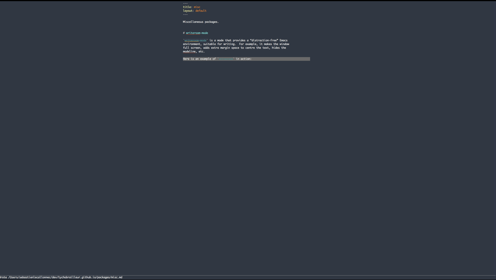

Miscellaneous packages.

# write-room-mode

`writeroom-mode` is a mode that provides a “distraction-free” Emacs
environment, suitable for writing.  For example, it makes the window
full screen, adds extra margin space to centre the text, hides the
mode line, etc.

Here is an example of `writeroom` in action:

{:width=600}
